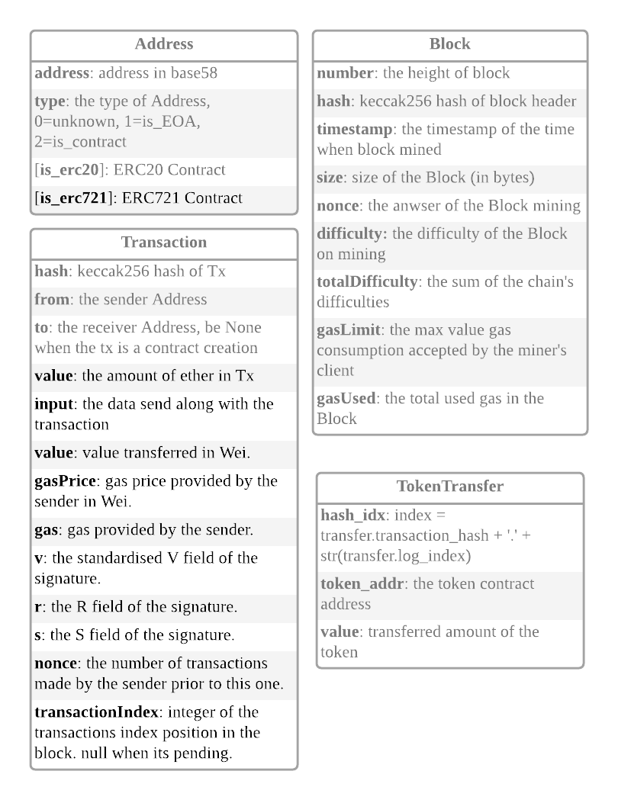

# Project ET[H&L]

Neo4j ETL for Ethereum network data

## Requirement

Neo4j >= v4.4

Python 3.9

## Usage

Install deps: `pip3 install -r requirements.txt`

Run `__main__.py`

## TODO

- fix bugs on ERC20/721 detection
- Block/UncleReward value
- Support Multithreads/Coroutines

## FAQ

> invalid instruction: PUSHXX

please ignore the warnning message 
https://github.com/blockchain-etl/ethereum-etl/issues/143#issuecomment-454787516

## Graph

## Entities

## Thanks and some code copyleft

[ethereum-etl](https://github.com/blockchain-etl/ethereum-etl)
